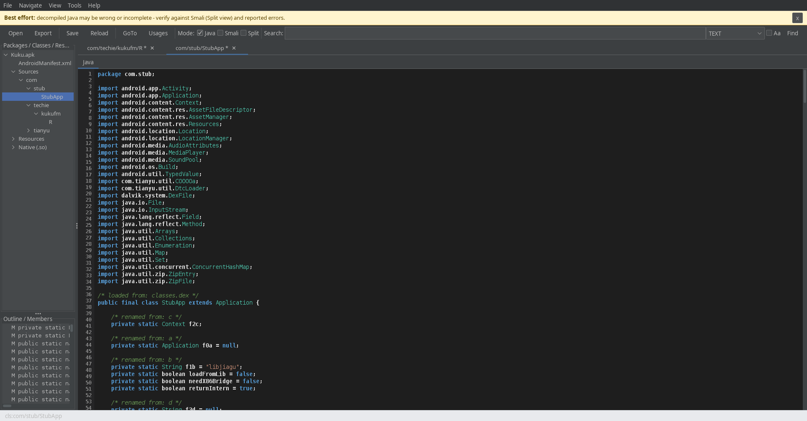
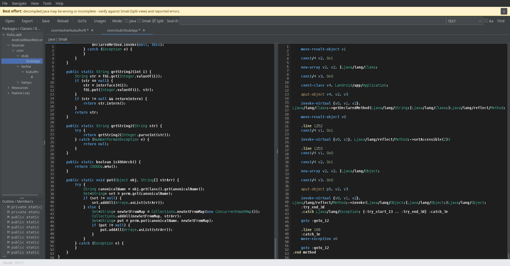

# JADX Studio

**A desktop decompiler GUI and batch CLI for Android artifacts**, built on top of the
[jadx](https://github.com/skylot/jadx) engine (Apache-2.0) as a library.

Open an APK / DEX / AAR / AAB / ZIP / JAR / class, browse its package tree, read and edit the
decompiled Java, cross-check it against Smali side by side, analyse native `.so` libraries and
binary Android XML — then export sources, resources and reproducible deobfuscation mappings.

> ⚠️ **Decompilation is best effort.** Java is *reconstructed* from Dalvik bytecode and may be wrong,
> incomplete, or not compile. Always verify important findings against the **Smali** view (Split mode)
> and the reported errors. The same warning appears in the GUI banner and is written into every export.

---

## Screenshots

**Main window** — package tree, resources and native libraries on the left, syntax-highlighted editor,
member outline below.



**Split view** — reconstructed Java on the left, the real Dalvik Smali on the right. The fastest way to
check that a decompiled method actually does what you think it does.



---

## Features

### GUI

| Area | What you get |
|------|--------------|
| **Open** | APK / DEX / AAR / AAB / ZIP / JAR / CLASS, via `File ▸ Open` or a file argument |
| **Browser** | Package → class tree, resources tree, native (`lib/*/*.so`) tree |
| **Editors** | Syntax-highlighted, editable, line numbers, dirty markers (`*`) |
| **View modes** | `Java` · `Smali` · `Split (Java \| Smali)` — switchable per class, at any time |
| **Navigation** | Outline/members, **Go to declaration** (Ctrl+G), **Find usages** (Ctrl+U), Back/Forward (Alt+←/→) |
| **Search** | Full-text search across sources, manifest and text resources (regex + case options) |
| **Resources** | Decoded `AndroidManifest.xml`, `res/**` values, layouts, assets |
| **Editing** | Edit code in place, `Save` stores it in the project, `Export all edits…` writes files |
| **Deobfuscation** | Mapping editor (classes / methods / fields / packages) + re-decompile, `.jobf` save/load |
| **Native** | `.so` analysis: ELF structure, symbols, strings, findings, **function list + assembly**, and **C pseudocode** |
| **XML** | Binary AXML decoder + manifest permission / exported / debuggable analysis |
| **Packing** | Packer & protector detection, PairIP / jiagu unpacking, Flutter / Dart analysis |

### CLI

Batch decompilation with sensible defaults, one output folder per input:

```bash
jadx-studio -o out/ app.apk              # sources + resources
jadx-studio -o out/ --no-res app.apk     # sources only
jadx-studio -o out/ --no-src app.apk     # resources only
jadx-studio -o out/ --map renames.jobf app.apk
jadx-studio -o out/ --export app.apk     # export in-editor edits as well
jadx-studio -o out/ --quiet app.apk      # less console noise
jadx-studio --gui app.apk                # open the GUI with the file
jadx-studio --help
```

Output layout:

```
out/
  sources/            decompiled .java (mirrors package structure)
  resources/          decoded AndroidManifest.xml, res/**, assets, native libs
  <input>.jobf        deobfuscation mapping (reused on the next run)
  DISCLAIMER.txt      best-effort notice
```

---

## Build & run

Requires **JDK 17+** and network access to Maven Central on the first build.

```bash
cd jadx-studio
./gradlew installDist          # or: gradle installDist
```

Then:

```bash
./run.sh                      # GUI
./run.sh --gui app.apk        # GUI with a file
./run.sh -o out app.apk       # CLI
```

Or run the generated launcher directly:

```bash
build/install/jadx-studio/bin/jadx-studio          # GUI
build/install/jadx-studio/bin/jadx-studio -o out app.apk
build/install/jadx-studio/bin/jadx-studio.bat      # Windows
```

`./gradlew run` also works (GUI). Tests are disabled — use the CLI or GUI to verify.

---

## Keyboard shortcuts

| Shortcut | Action |
|----------|--------|
| `Ctrl+O` | Open file |
| `Ctrl+S` | Save current edit |
| `Ctrl+G` | Go to declaration |
| `Ctrl+U` | Find usages |
| `Ctrl+F` | Search all text |
| `Ctrl+W` | Close current tab |
| `Alt+←` / `Alt+→` | Back / Forward |

---

## Deobfuscation workflow

1. Load the APK — jadx renames short/obfuscated names and writes `<input>.jobf` next to the APK.
2. `Tools ▸ Deobfuscation / mappings…` shows every rename in editable tables.
   Format per line: `c com.example.Foo = ReadableName`, `m com.example.Foo.bar()V = doBar`,
   `f com.example.Foo.x:I = count`, `p com.example = com.example.sub`.
3. Edit names (clear a *new name* cell to drop that rename), then **Apply** — the project is
   re-decompiled with your mapping, and your in-editor edits are re-applied on top.
4. **Save…** writes the `.jobf` file so renames are reproducible in later runs (also used by `--map`).

---

## Native library analysis (`.so` → assembly + C pseudocode)

Open a native library with `Tools ▸ Analyze .so (native)…` (or double-click a `lib/*/*.so` entry in the
tree). Tabs: **Overview**, **Functions / Assembly / Pseudocode**, **Strings**, **Findings**, **Structure**.

The middle tab is the analysis workspace:

- **Function list** — click a row to load that function. The filter box filters by name.
- **Assembly** (left) — real disassembly for the selected function.
- **C pseudocode** (right) — the same function as C, so you can walk a call in the asm and read its
  C form side by side.
- **References to this address** — who calls or references the selected function.

### Backends (real tools, detected at runtime)

| Output | Backend | Notes |
|--------|---------|-------|
| Functions + assembly | **radare2** or **rizin** | also used for its own analysis, so stripped libs still yield functions |
| C pseudocode | **Ghidra headless** (`analyzeHeadless`) | click *Generate C pseudocode (Ghidra)*; result cached per library |
| C pseudocode (alt) | radare2/rizin `pdg` / `pdc` plugin | used automatically when installed |
| ELF structure, strings, heuristics | built-in parser | no external tool needed |

Status of each backend is shown in the window (and in **Overview**). Nothing is fabricated: if a backend
is missing, the corresponding view says what is missing instead of guessing. Ghidra analysis is cached
under `~/.cache/jadx-studio/native/` keyed by file hash, so it runs once per library.

Addresses are unified across backends (ELF-relative), so a function address is the same number in the
asm view, the pseudocode view and the ELF section list.

---

## Project layout

```
src/main/java/com/jadxstudio/
  Main.java              entry point: args -> CLI, no args -> GUI
  core/                  Project (engine), CodeHolder, JavaIndex, export options
  editor/                CodeEditor (JTextPane + gutter), CodeDocument (incremental highlighting),
                         JavaTokenizer, CodeTabs
  gui/                   MainWindow, dialogs (GoTo/Search/Deobfuscation/So/Xml/About)
  analysis/so/           ElfScanner, ElfInfo, SymbolInfo — ELF parsing + heuristics
  analysis/nativecode/   NativeAnalysis + backends: DisasmBackend (radare2/rizin),
                         GhidraBackend (headless C pseudocode), BackendLocator (runtime detection)
  analysis/xml/          XmlAnalyzer, AxmlDoc — binary AXML decoder + findings
  analysis/protect/      ProtectorScanner — packer / protector detection
  analysis/pairip/       PairipAnalyzer — PairIP stub handling
  analysis/unpack/       PackedPayloadScanner — packed payload extraction
  analysis/flutter/      FlutterAnalyzer — Dart snapshot / libapp.so inspection
  cli/Cli.java           batch interface
```

---

## Notes & limits

- Decompiled Java is generated output; treat it as a lead, not as ground truth.
- Very large APKs (tens of thousands of classes) take time and memory to decompile on load.
- The `.so` parser reads ELF32/ELF64 (LE/BE). Packed libraries with wiped section headers will show
  few sections/symbols — strings and dynamic behaviour hints still work.
- Binary XML decoding handles namespaces, typed values and resources; text round-trip is for
  reading, not for rebuilding an APK.
- Decompiled output is written to `sources/`; the original DEX is never modified.

---

## License & attribution

JADX Studio is released under the **Apache License 2.0** — see [LICENSE](LICENSE).

This project bundles [jadx](https://github.com/skylot/jadx) (Apache-2.0) as a dependency and credits it
as the decompilation engine. Native analysis integrates with **radare2**/**rizin** and **Ghidra**, which
are optional and detected at runtime.

Verify any finding yourself before acting on it.

<!-- Screenshots: screenshots/01-main-window.png, screenshots/02-split-java-smali.png -->